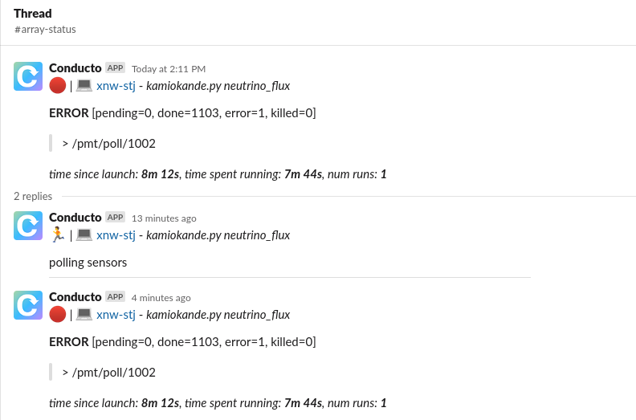

# Slack (callback interface)

Configure Conducto to send Slack updates about pipeline node state.

Here's what it looks like if
1. the node starts running
2. its state later changes to error

The main message gets updated to show the current state, and a thread is used to capture the story.

### You'll need

1. A Slack workspace
2. Conducto configured to use it

### To Run

First modify [pipeline.py](./pipeline.py) and replace `SlackUser` with the user (or `#channel`) that you want to notify.
Then run the pipeline.

    python pipeline.py --local --run

### How it works

 1. There are many parallel nodes, one will have an error
 2. The root node is configured to notify Slack when it changes state
 3. First Slack will get a "running" message
 4. Later Slack will get an "error" message
