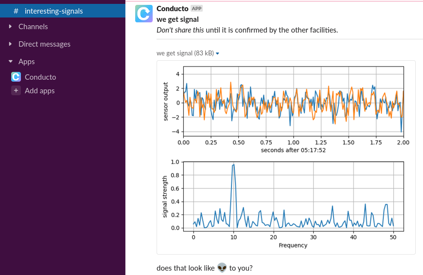

# Slack (direct interface)

Talk to Slack from your pipeline code.

### You'll need

1. A Slack workspace
2. Conducto configured to use it
3. Somewhere to publicly host images (if you want to post images)

This example uses an AWS S3 bucket for #3, see [aws.py](aws.py).

### To Run

    python pipeline.py --local

### How it works

 1. A pipeline node calls a function in [sensors.py](sensors.py)
 2. That function generates a visualization (png) and returns a number
 3. A later node posts the visualization in a Slack channel
 4. If the number is high enough, certain users are notified too
